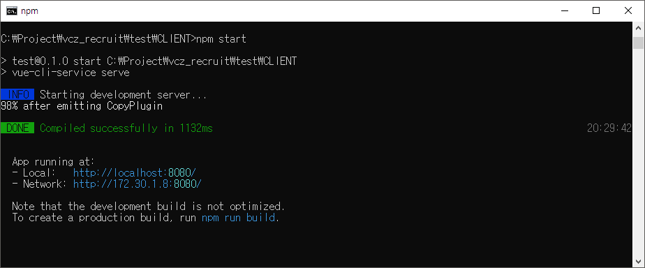
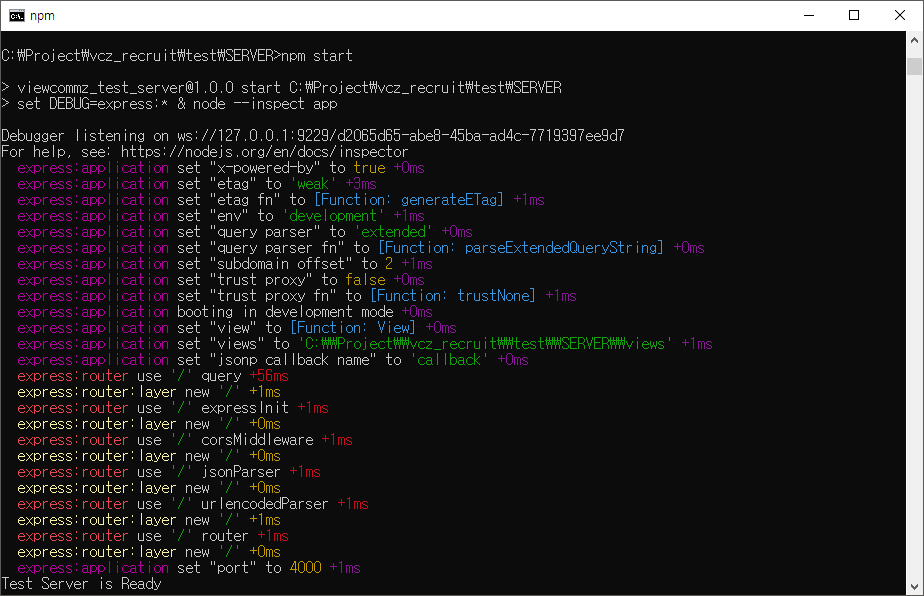
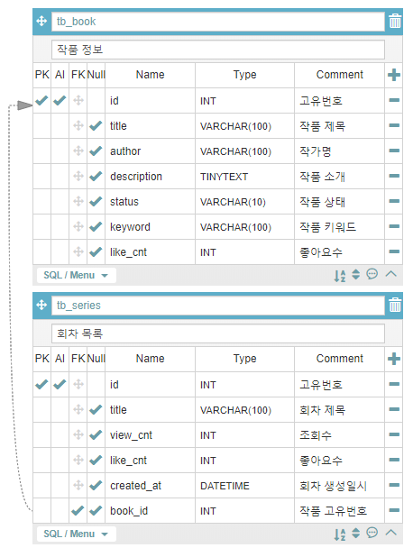
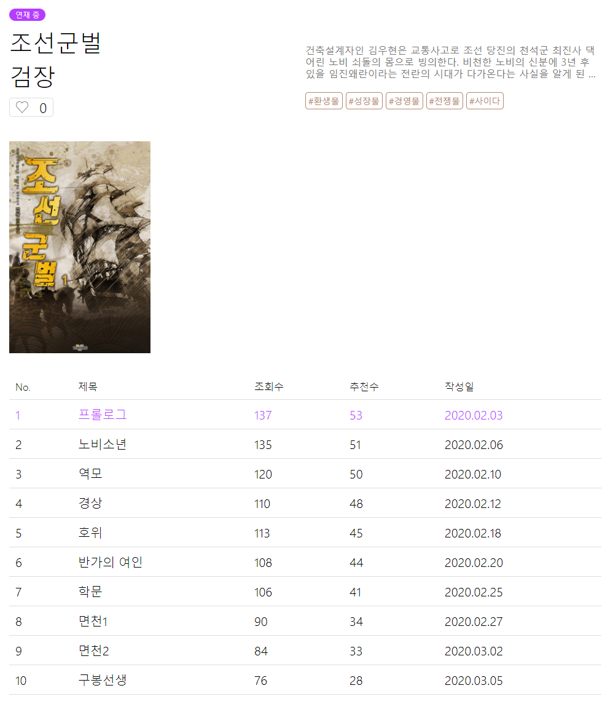

# 뷰컴즈 코딩테스트
뷰컴즈에 지원해주신 개발자 여러분을 환영합니다! 아래의 코딩 테스트는 기존의 알고리즘 테스트 형태를 지양하고 실무적으로 필요한 역량만을 확인해보기 위하여 고안되었습니다. 실제 업무에서 부딪힐 수 있는 간단한 문제들로 구성하였으며 지원해 주신 개발자분들의 기본 지식, 검색 활용능력과 응용력을 측정하고자 합니다. 그럼 아래의 테스트를 진행해주세요.

## [개발환경]
 * 기본 개발툴은 VSCode를 사용하며, 필요 시 본인에 맞는 툴을 설치하여 사용하셔도 무방합니다.
 * 소스는 CLIENT와 SERVER 두 폴더로 나누어져 있으며 각각 프론트엔드와 백엔드 서버가 구성되어 있습니다.
 * CLIENT의 경우 Vue.js 템플릿을 이용하여 프론트엔드를 구성합니다.
 * SERVER의 경우 Express.js 템플릿을 이용하여 백엔드를 구성합니다.
 * 각각의 서버는 Node.js 패키지 명령어인 npm start 명령어를 통해 쉽게 실행 가능합니다.	

 >프론트엔드 서버 실행 예시   
 >

 >벡인드 서버 실행 예시  
 >

 * 프론트엔드는 CLIENT/src/views/Home.vue 소스를 수정하여 문제를 해결하세요.
 * 백엔드는 SERVER/router/index.js 소스를 수정하여 문제를 해결하세요.
 * 각각의 서버 실행 후 http://localhost:8080 으로 접속하여 개발된 페이지를 확인할 수 있습니다.
 * MariaDB(Mysql)을 통해 DB와 데이터를 주고 받습니다.
 * 데이터베이스는 아래 두개의 테이블로 구성되어 있습니다.

 >데이터베이스 구성  
 > 

## [문제]
 뷰컴즈는 현재 웹소설을 공유할 수 있는 웹 플랫폼을 구축하고 있습니다. 그 중 웹소설 작품의 기본 정보를 조회하고 해당작품의 각 회차를 조회할 수 있는 화면을 구현하고자 합니다. 세부 문항에 따라 화면 및 기능을 개발하여 최종적으로 아래 예시와 같은 화면이 만들어질 수 있도록 개발해주세요.

#### 1. tb_series 테이블로부터 회차목록을 불러와 화면에 리스트를 구현해주세요.
#### 2. 좋아요 버튼(하트모양)을 클릭 시 숫자가 1 증가하며 tb_book 테이블에도 숫자가 증가하여 저장되도록 구현해주시고, 한번 더 클릭 시에는 숫자가 1 감소하며 마찬가지로 tb_book 테이블에도 숫자가 감소하도록 구현해주세요.
#### 3. tb_series 테이블로부터 호출 시 작성일자는 “2020-00-00 00:00:00” 와 같은 형태로 불러오게 됩니다. 이를 사용자가 보기 편하도록 “2020.00.00” 형태로 표시될 수 있도록 필터 기능을 구현해주세요.
#### 4. 작품 소개를 호출 시 너무 길어서 사용자가 보기 불편합니다. 이를 3줄로 줄여서 표시되도록 CSS를 변경하여주세요.

## [완성 예시]  
